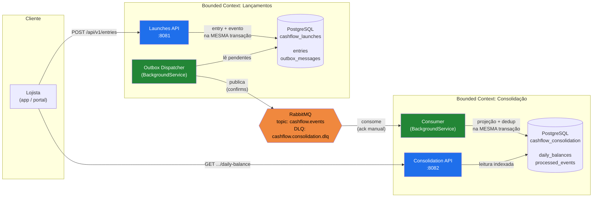
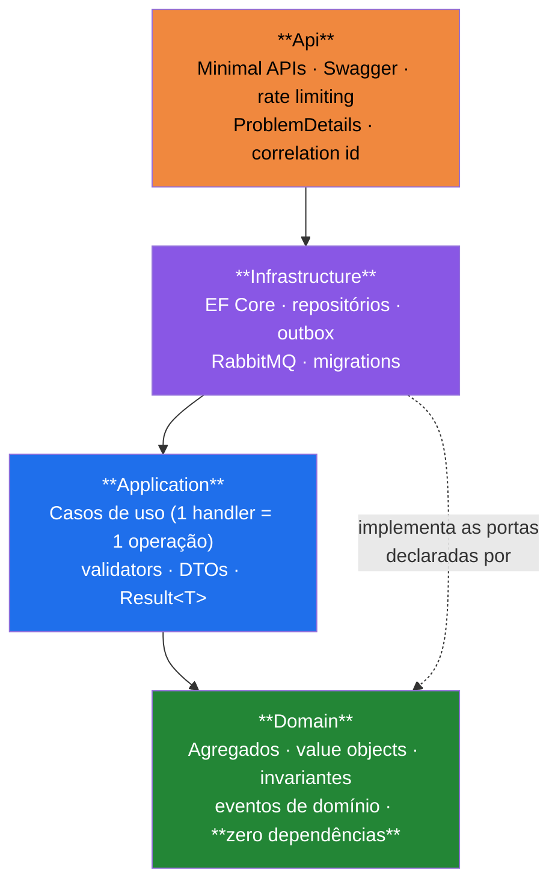
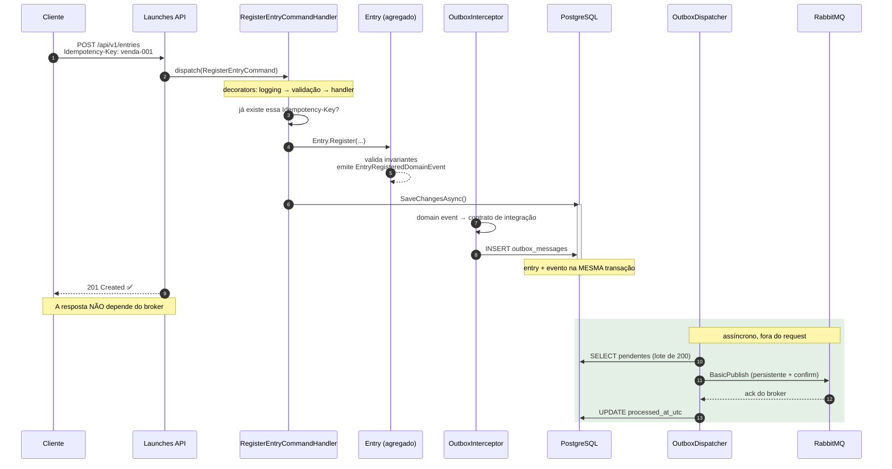
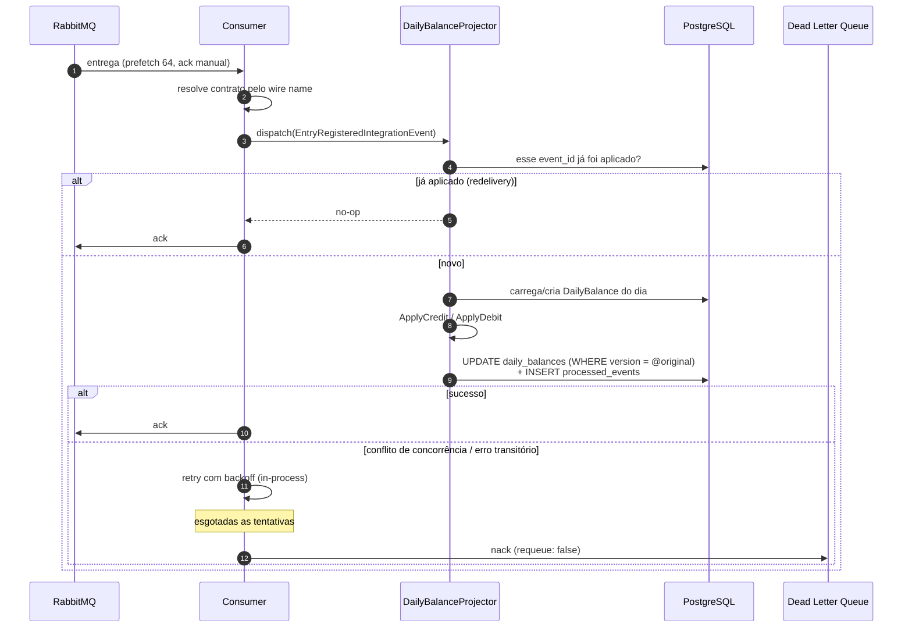
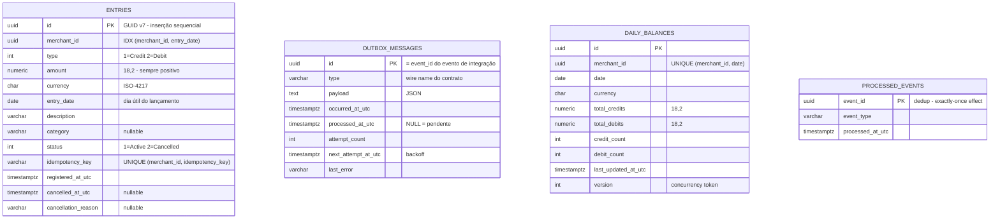
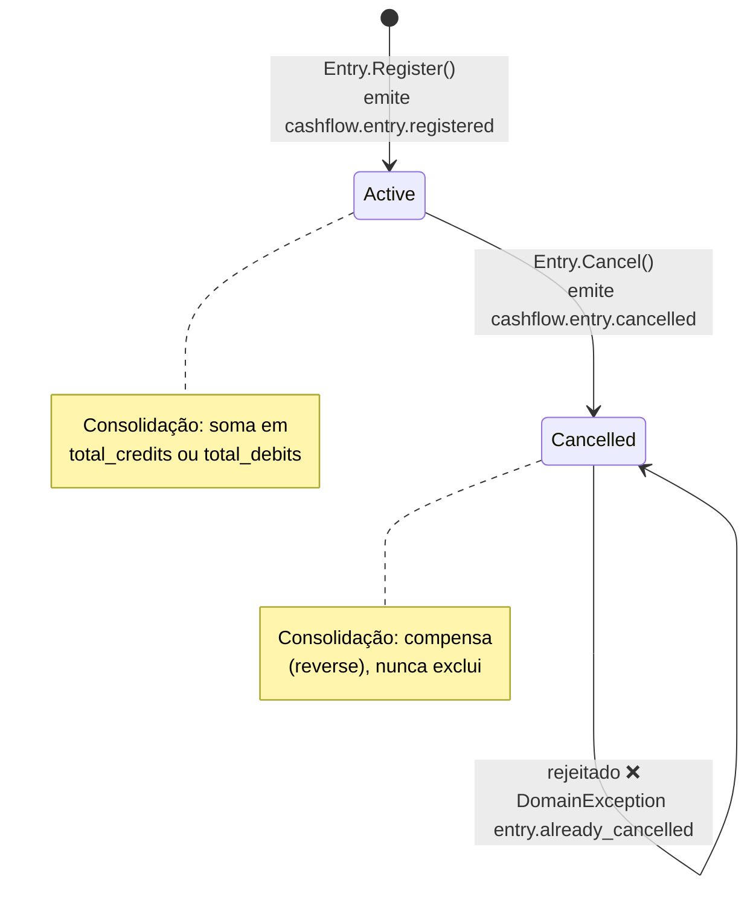

# Arquitetura — CashFlow

Documento complementar ao [README](../README.md), com o detalhamento visual da solução.

---

## 1. Visão de contêineres



**A leitura nunca atravessa a escrita.** A Launches API não conhece a Consolidation API — as duas
só compartilham um contrato de mensagem. Nenhuma chamada síncrona entre serviços significa que
nenhuma falha de um derruba o outro.

---

## 2. Camadas de cada serviço



A seta tracejada é a **inversão de dependência**: `IEntryRepository` é declarada no domínio e
implementada na infraestrutura. Trocar EF Core por Dapper não toca uma linha de regra de negócio.

---

## 3. Fluxo de escrita — Transactional Outbox



Se o passo de publicação falhar, a linha permanece pendente com `attempt_count` incrementado e
`next_attempt_at_utc` no futuro (backoff exponencial + jitter). **O cliente já recebeu 201 e nada
se perde.**

---

## 4. Fluxo de consolidação — consumo idempotente



Três garantias que se somam:

| Garantia | Mecanismo |
|---|---|
| Nada é aplicado duas vezes | `processed_events` com PK no `event_id`, na mesma transação |
| Nada é perdido em caso de crash | Ack manual — só após o handler concluir |
| Nada trava a fila para sempre | Retry limitado, depois dead-letter para inspeção |

---

## 5. Modelo de dados



`ENTRIES` e `OUTBOX_MESSAGES` vivem no banco do serviço de lançamentos; `DAILY_BALANCES` e
`PROCESSED_EVENTS`, no da consolidação. **Não há chave estrangeira entre os dois lados** — é
justamente essa ausência de acoplamento que permite escalar, versionar e falhar de forma
independente. O `balance` não é coluna: é derivado (`total_credits - total_debits`), para que não
exista a possibilidade de divergir dos totais.

---

## 6. Ciclo de vida de um lançamento



Não há transição de saída de `Cancelled`: registro financeiro não se apaga nem se ressuscita.
Correções são novos lançamentos.

---

## 7. Contratos de integração

Publicados no exchange `cashflow.events` (tipo *topic*), usando o **wire name** como routing key:

| Wire name | Quando | Efeito na consolidação |
|---|---|---|
| `cashflow.entry.registered` | Lançamento registrado e persistido | Soma ao total de créditos ou débitos do dia |
| `cashflow.entry.cancelled` | Lançamento cancelado | Compensa o valor original |

```jsonc
// cashflow.entry.registered
{
  "eventId": "01a01005-3a13-76fd-903c-2e33a04e5531",  // chave de deduplicação
  "occurredAtUtc": "2026-08-17T13:59:33.13+00:00",
  "correlationId": "0HNNSCSTQQJU2:00000001",
  "entryId": "01a01005-3a13-76fd-903c-2e33a04e5531",
  "merchantId": "3efabaf2-57c5-4563-80e4-7d39714bc5e7",
  "type": "Credit",                                    // nome, não ordinal
  "amount": 1500.00,                                   // sempre positivo
  "currency": "BRL",
  "entryDate": "2026-08-17",
  "description": "Venda no cartao"
}
```

Duas escolhas deliberadas de contrato:

- **O wire name é desacoplado do tipo CLR.** Renomear a classe, mover de namespace ou reescrever o
  produtor em outra linguagem não quebra o consumidor.
- **Enums viajam como nome, não como ordinal.** Reordenar o enum não corrompe mensagens em trânsito.

---

## 8. Onde cada requisito não funcional é atendido

```mermaid
flowchart TB
    subgraph R1["'Operante mesmo com falha na consolidação'"]
        direction LR
        A1["Outbox transacional"] --> A2["Publicação em background"]
        A2 --> A3["Backoff + jitter"]
        A3 --> A4["Circuit breaker"]
        A4 --> A5["Broker = Degraded,<br/>nunca Unhealthy"]
    end

    subgraph R2["'50 req/s no pico, até 5% de perda'"]
        direction LR
        B1["Projeção pré-agregada<br/>(custo constante)"] --> B2["OutputCache 5s"]
        B2 --> B3["Rate limit token bucket<br/>+ fila limitada"]
        B3 --> B4["429 + Retry-After<br/>(degradação graciosa)"]
    end

    subgraph R3["Consistência do saldo"]
        direction LR
        C1["Idempotency-Key<br/>na entrada"] --> C2["Dedup por event_id<br/>no consumo"]
        C2 --> C3["Concorrência otimista<br/>(version)"]
        C3 --> C4["Compensação<br/>em vez de exclusão"]
    end

    style R1 fill:#238636,color:#fff
    style R2 fill:#1f6feb,color:#fff
    style R3 fill:#8957e5,color:#fff
```



---

## 9. Evolução natural da arquitetura

O desenho de hoje é o mínimo coerente para o problema. Os pontos de crescimento já estão isolados:

| Pressão | Resposta | O que já está preparado |
|---|---|---|
| Volume de escrita | Escalar réplicas da Launches API | Stateless; outbox por linha, sem estado em memória |
| Volume de leitura | Escalar réplicas da Consolidation API + read replicas | Leitura já é `AsNoTracking` e cacheável |
| Lag de consolidação | Extrair o dispatcher para worker dedicado | `OutboxDispatcher` é uma classe isolada e testável |
| Muitos consumidores | Aumentar `prefetch` / `ConsumerConcurrency` | Configuração, sem mudança de código |
| Outro transporte (Kafka, SQS) | Novo adaptador de `IIntegrationEventPublisher` | A aplicação só conhece a abstração |
| Histórico muito grande | Particionar `daily_balances` por data | A projeção já é derivável e reconstruível |
